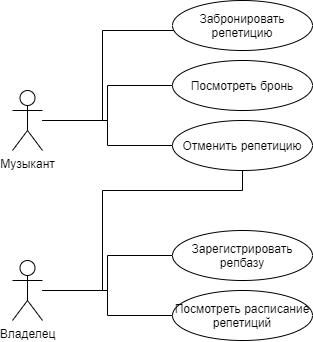
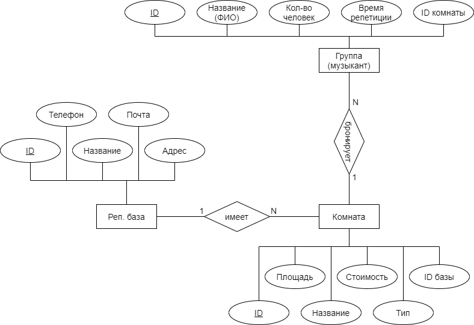

**Название проекта** - HearBase

## Идея

Приложение, содержащее информацию о репетиционных базах с возможностью для музыканта бронировать или отменять свои репетиции,
а для владельца репбазы - отслеживать записи на свою репбазу.

## Предметная область

Репетиционные базы, которые состоят из одной или нескольких комнат. Каждую из этих комнат может забронировать группа (музыкант)
на определённое время.

## Анализ аналогичных решений

| Название   | Удобство пользования | Проблемы | Наличие других городов (кроме мск) |
|------------|----------------------|----------|------------------------------------|
| MUSbooking | Нет возможности посмотреть все репбазы (только на определённое время) | -- | + |
| TONESKY    | Не видно заранее цены | Не работает поиск по названию базы | - |

## Целесообразность и актуальность

Проблема поиска места для репетиций является актуальной для любого музыканта, тем более группы.  
В крупных городах есть достаточно много репетиционных баз. Все они имеют разные цены и характеристики.  
Поэтому существует потребность в приложении, которое собирало бы воедино всю имеющуюся информацию о различных
репетиционных базах, таким образом освобождая музыкантов от необходимости вручную искать и изучать каждую репбазу,
заходить на их сайты, звонить лично, чтобы забронировать репетицию и т. д.

## Use-Case диаграмма

## ER диаграмма сущностей

